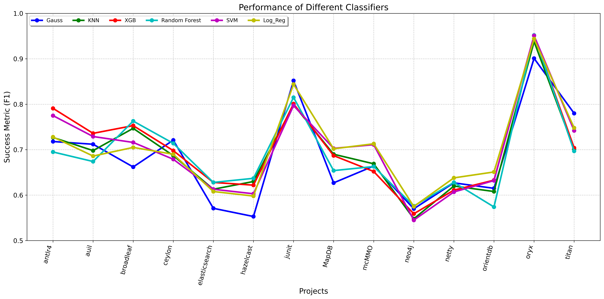
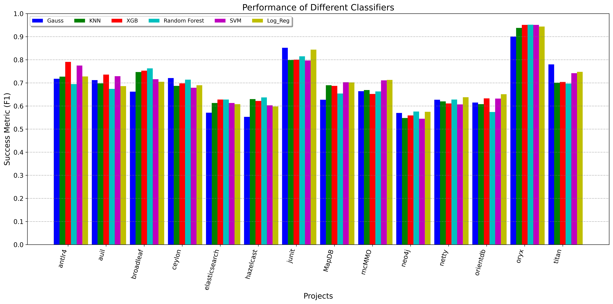
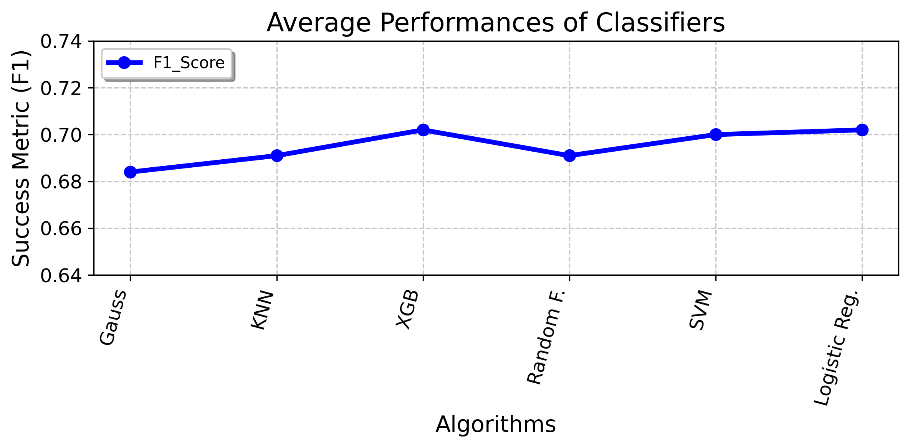

  

Code written to train logistic regression, XGB, Random Forest, SVM, GaussianNB, KNN algorithms for the bughunter dataset

### **Data Preprocessing**
 - If the proportion of a data in the data distribution of a column is more than 80%, that column is removed from the data set.
 - If the absolute value of the correlation between a column and the target column is less than 0.01, that column is discarded from the data set.

### **Algorithms are trained in two different ways: default and tuned.:**

 - **Tuned parameters for Logistic Regression are:** "penalty='l2', C=1.0"
 - **Tuned parameters for XGB:** "n_estimators = 50, learning_rate = 0.01, max_depth = 3, subsample = 0.8, colsample_bytree = 1.0"  
 - **Tuned parameters for Random Forest:** "min_samples_split=5, n_estimators=50"  
 - **Tuned parameters for SVM:**  "C=1, kernel='linear'" 
 - **There is no tuned version for GaussianNB** 
 - **Tuned parameters for KNN:** "leaf_size=10, n_neighbors=3, p=1"

Link to download the dataset: [dataset link](https://data.mendeley.com/datasets/8tx7kjbkg4/2)

The class.csv file in each folder in the data set will be taken as the data set. For each project, all algorithms will be trained and the best version of each algorithm will be saved in the model_data folder.

Files to be saved by the program
- There will be a csv file containing the f1 score of each algorithm in the "method_name_values.csv" file in the model_data/method_name/ folder.
- For each algorithm, there will be a folder named model_name in the model_data/method_name folder and X_train, X_test, y_train, y_test csv files and the joblib file in which the model is saved.

  ### **Result Graphs**
  **Line chart**
  
  **Bar chart**
  
  **Line chart of classifier performances**
  

